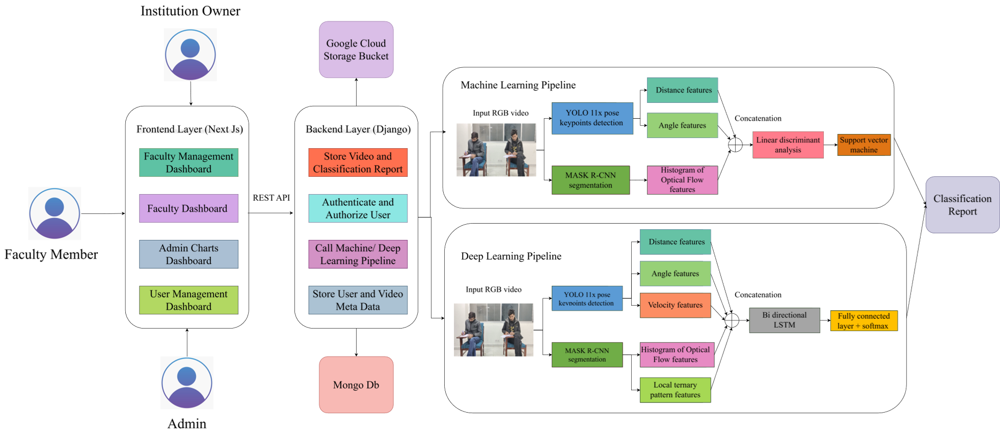
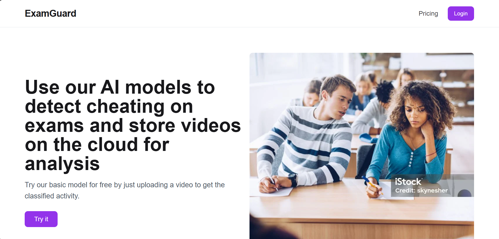
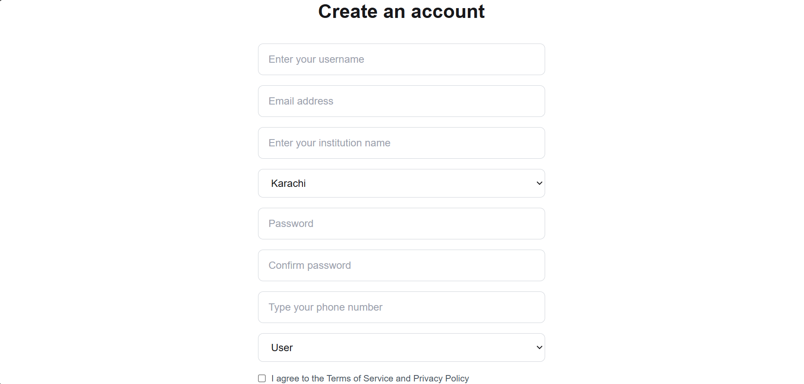
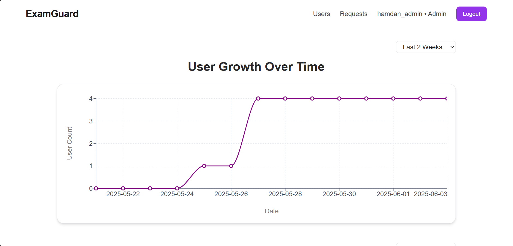
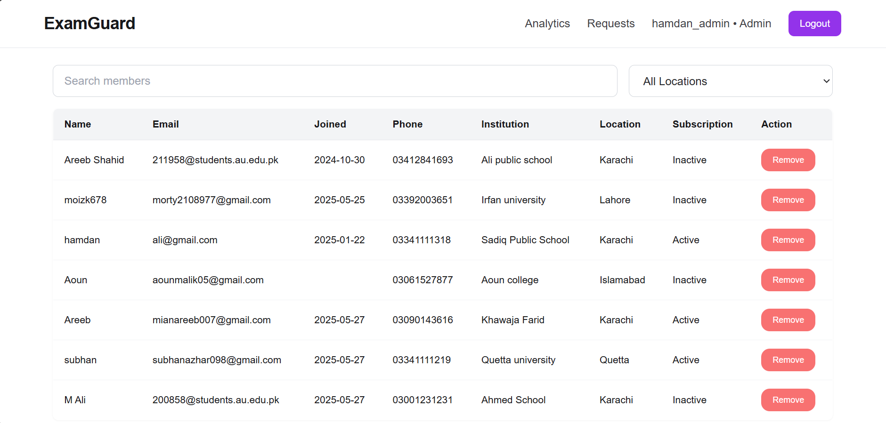
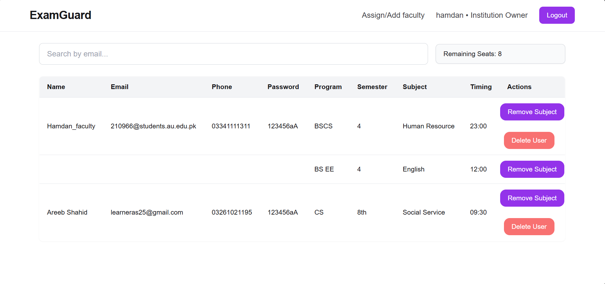
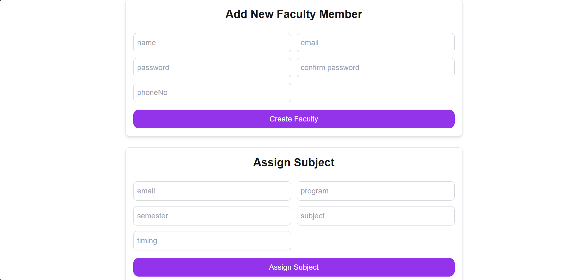
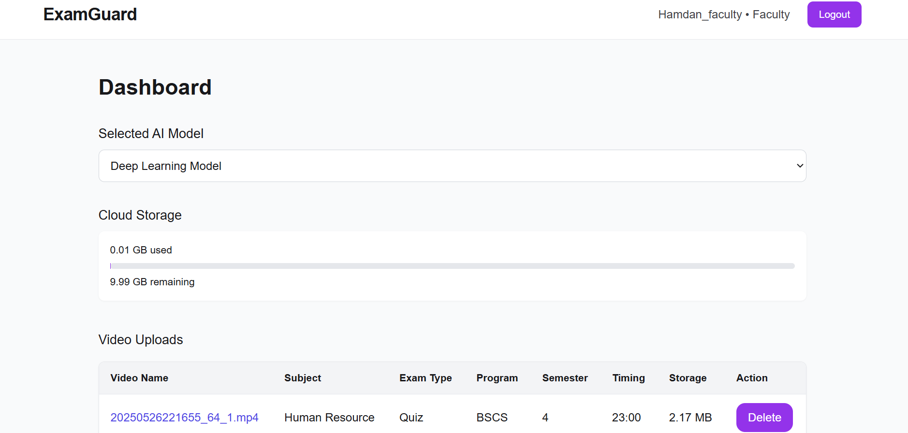
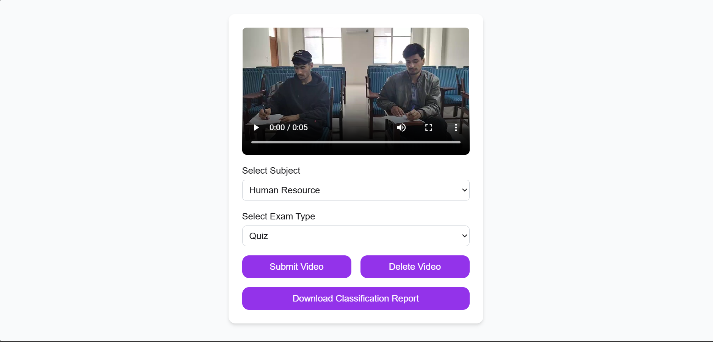

# 🎓 ExamGuard - Intelligent Student Interaction Surveillance and Management System  (Final Year Project)

**An intelligent AI-powered system for recognizing student activities from classroom video footage using advanced machine learning and deep learning pipelines.**

🔗 [ **Live Demo**](https://fyp-frontend-ajmm.onrender.com)  

## 🚀 Overview

This Computer Vision focused project is a web-based platform, aimed at automating the classification of student activities like **passing paper**, **looking at others' work**, and **doing own work** in a classroom setting. The system leverages two separate systems: **machine learning based pipeline** and **deep learning based pipeline** for classification. The user selects the pipeline type and inputs a video of two students performing an activity. The system produces a pdf report as output which includes visualizations of segmentation, keypoints detection and extracted features as well as activity classified by the pipeline. A total of 90 videos—approximately 75 custom and the rest from academic sources—were used for training and testing. For each video, the middle 40 frames were selected for classification. Three-fold cross-validation was performed to evaluate the pipelines.

## ⚙️ System architecture




## 📊 Experimental Results

### 📈 Average Accuracy, Precision, Recall, F1-Score

#### 🤖 Machine Learning Pipeline

| Class | Precision | Recall | F1-Score |
|-------|----------|----------------|-------------|
| **Doing Own Work** | 0.81 | 0.90 | 0.85 |
| **Passing Paper** | 1.00 | 0.91 | 0.95 |
| **Looking at Other's Work** | 0.86 | 0.83 | 0.84 |
| **Average** | 0.89 | 0.88 | 0.88 |

---
**Average Accuracy** 87.9%

#### 🧠 Deep Learning Pipeline

| Class | Precision | Recall | F1-Score |
|-------|----------|----------------|-------------|
| **Doing Own Work** | 0.87 | 0.91 | 0.89 |
| **Passing Paper** | 0.93 | 0.97 | 0.95 |
| **Looking at Other's Work** | 0.86 | 0.80 | 0.83 |
| **Average** | 0.89 | 0.89 | 0.89 |

---
**Average Accuracy** 88.8%

### 🧮 Confusion matrix

#### 🤖 Machine Learning Pipeline

| Class | Doing Own Work | Passing Paper | Looking at Other's work |
|-------|----------|----------------|-------------|
| **Doing Own Work** | 0.90 | 0.00 | 0.10 |
| **Passing Paper** | 0.07 | 0.90 | 0.03 |
| **Looking at Other's Work** | 0.17 | 0.00 | 0.83 |

#### 🧠 Deep Learning Pipeline

| Class | Doing Own Work | Passing Paper | Looking at Other's work |
|-------|----------|----------------|-------------|
| **Doing Own Work** | 0.90 | 0.00 | 0.10 |
| **Passing Paper** | 0.00 | 0.97 | 0.03 |
| **Looking at Other's Work** | 0.13 | 0.07 | 0.80 |

## 📚 Datasets Used

<table>
  <tr>
    <td align="center"></td>
    <td align="center"></td>
  </tr>
  <tr>
    <td align="center"><strong>🏫 Academic Dataset Sample</strong></td>
    <td align="center"><strong>🧑‍🎓 Custom Dataset Sample</strong></td>
  </tr>
</table>

## 📄 Sample Classification Report

You can try out our system by uploading a video from the dataset to receive a classification report.

For a quick preview, check out the following sample:

- 🎥 [Example Video](assets/example_video.mp4)  
- 📄 [Corresponding Classification Report (PDF)](assets/example_classification_report.pdf)


## 🧰 Tools, Technologies & Skills Used

### 📦 AI/ML & Deep Learning
- **Python**, **Google Colab**, **NumPy**, **Pandas**
- **PyTorch** (for Bidirectional LSTM)
- **Scikit-learn** (for Support Vector Machine, Linear Discriminant Analysis)
- **OpenCV** (for image processing and feature extraction), **Matplotlib** (for visualization)

### 🌐 Full Stack Development
- **Frontend:** Next.js (React framework)
- **Backend:** Django with Django REST Framework (DRF)
- **Cloud Storage:** Google Cloud Storage (for videos/reports)
- **Database:** MongoDB Atlas
- **Styling:** Tailwind CSS


### 🛠️ Development Tools
- **Visual Studio Code**
- **Postman**
- **Git / GitHub**


### ☁️ Deployment & Hosting
- **Render** – Web app hosting (frontend/backend)
- **Modal** – Model inference server
- **MongoDB Atlas** – Cloud-hosted database for storing User and Video metadata
- **Google Cloud Storage** – Storage for videos, reports, and images


## 💡 System Features
- **Role-Based Access Control** for three user types: *Admin*, *Institution Owner*, and *Faculty Member*  
- **Institution Owner** can subscribe to access faculty dashboards  
- **Institution Owner** can create and manage Faculty Member accounts, including assigning specific subjects, schedules, and other key details  
- **Faculty Members** can select a classification pipeline (*Machine Learning* or *Deep Learning*) before uploading videos  
- **Secure Authentication** with login and OTP (One-Time Password) verification  
- **Cloud-Based Video Storage** for Faculty Members, accessible via their individual dashboards  
- **Classification Output** provided as PDF reports containing feature extraction visualizations and classification results  
- **Admin Dashboard** for Institution Owners to manage users and handle subscription requests  


## 📸 Project UI

<table>
  <tr>
    <td align="center"></td>
    <td align="center"></td>
  </tr>
  <tr>
    <td align="center"><strong>🏠 Landing Page</strong></td>
    <td align="center"><strong>📝 Sign-Up Page</strong></td>
  </tr>

  <tr><td colspan="2"><br/></td></tr>

  <tr>
    <td align="center"></td>
    <td align="center"></td>
  </tr>
  <tr>
    <td align="center"><strong>📊 Admin Analytics Page</strong></td>
    <td align="center"><strong>🛠️ Admin Dashboard</strong></td>
  </tr>

  <tr><td colspan="2"><br/></td></tr>

  <tr>
    <td align="center"></td>
    <td align="center"></td>
  </tr>
  <tr>
    <td align="center"><strong>🏫 Institution Owner Dashboard</strong></td>
    <td align="center"><strong>👩‍🏫 Add/Assign Faculty Page</strong></td>
  </tr>

  <tr><td colspan="2"><br/></td></tr>

  <tr>
    <td align="center"></td>
    <td align="center"></td>
  </tr>
  <tr>
    <td align="center"><strong>🧑‍🏫 Faculty Member Dashboard</strong></td>
    <td align="center"><strong>📤 Upload Video Page</strong></td>
  </tr>
</table>


## 🧪 How to Use Locally

### 1. Clone the Repository
```bash
git clone https://github.com/Hamdan-Azhar/Final-year-project-repo.git
```

### 2. Run Frontend (Next.js)
```bash
cd frontend
npm install
npm run dev
```

### 3. Run Backend (Django)
```bash
cd backend
pip install -r requirements.txt
python manage.py runserver
```

> _Note: The Machine Learning and Deep Learning Pipelines are deployed remotely and integrated via REST APIs. For retraining or experimentation, use the provided Jupyter notebook on Google Colab. The model inference code is also included and can be explored to understand the inference workflow and classification report generation process._

---


## 🤝 Acknowledgements

Special thanks to:
- [**Dr. Ahmad Jalal**](https://scholar.google.com/citations?hl=en&user=BIRC9XEAAAAJ) – Project Supervisor
- Our peers, friends, and families for support
- Open-source community for the incredible libraries and tools

---

## ⭐ Final Notes

This project represents months of dedicated research and engineering, blending AI innovation with real-world educational needs. It's designed to be scalable, deployable, and adaptable to other human activity classification domains. 

If you find this project interesting, consider ⭐ starring the repo or reaching out for collaboration!

---
